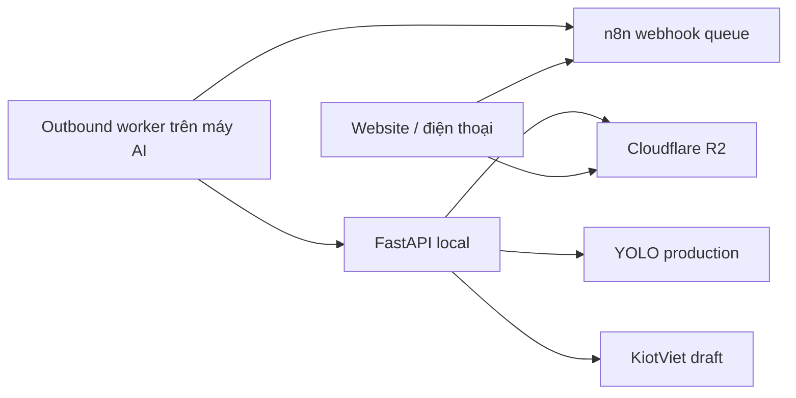

# Sharon Bakery AI Inventory

[](https://github.com/philonguit-blip/sharon-ai-inventory-inspection/actions/workflows/ci.yml)

Hệ thống web kiểm đếm sản phẩm bánh từ ảnh, tổng hợp số lượng, tạo file Excel
và chuẩn bị phiếu nhập nháp KiotViet. Giao diện production:

<https://sharon-bakery-inventory.pages.dev/>

## Kiến trúc production



- Website được triển khai trên Cloudflare Pages.
- Ảnh đi thẳng từ trình duyệt lên R2 bằng URL có thời hạn.
- n8n chỉ giữ metadata, hàng đợi và trạng thái xử lý.
- Worker trên máy AI chủ động kết nối ra n8n; không cần tunnel hoặc mở cổng vào máy.
- FastAPI xử lý ảnh bằng model production và cập nhật tiến độ sau từng ảnh.

## Thành phần repository

| Đường dẫn | Nội dung |
|---|---|
| `backend/app` | FastAPI, AI inference, R2, KiotViet và n8n gateway |
| `backend/frontend` | Giao diện Cloudflare Pages |
| `backend/models` | Model YOLO production hiện tại |
| `backend/templates` | Mẫu Excel phiếu nhập |
| `backend/tests` | Unit test và smoke test |
| `n8n` | Workflow outbound production, generator và test |
| `.github/workflows` | Kiểm thử tự động trên GitHub Actions |
| `docs` | Tài liệu quản lý artifact |

Dataset, pipeline video cũ, công cụ huấn luyện/pre-annotation, model thử nghiệm,
runtime, log và credential không thuộc repository production. Xem
[`docs/ARTIFACTS.md`](docs/ARTIFACTS.md).

## Cấu hình hiện tại

| Cấu hình | Giá trị |
|---|---:|
| Số ảnh tối đa mỗi lượt | 50 |
| Dung lượng tối đa mỗi ảnh | 50 MB |
| Tổng dung lượng mỗi lượt | 160 MB |
| Confidence tối thiểu | 0.55 |
| IoU | 0.50 |
| Kích thước suy luận | 1280 px |
| Worker truyền R2 song song | 4 luồng |

Suy luận YOLO vẫn chạy tuần tự theo ảnh để giữ ổn định CPU/RAM và kết quả.
Frontend hiển thị tiến độ thực tế `1/N`, `2/N` sau từng ảnh.

## Chạy hằng ngày trên máy AI

Sau khi bật máy:

1. Chạy `start_backend.bat` một lần.
2. Chờ dòng `Uvicorn running on http://127.0.0.1:8080`.
3. Chạy `start_worker.bat` một lần.
4. Giữ cả hai cửa sổ mở.
5. Mở local tại <http://127.0.0.1:8080> hoặc mở website production.
6. Chỉ upload khi giao diện báo **Hệ thống sẵn sàng**.

Không truy cập `http://0.0.0.0:8080`; đây chỉ là địa chỉ bind. Nếu báo
`WinError 10048`, backend đã chạy sẵn và không cần mở thêm lần nữa.

Khi tắt hệ thống, nhấn `Ctrl+C` ở worker trước rồi đến backend.

## Cài đặt trên máy mới

Yêu cầu Python 3.12 và Git:

```powershell
git clone https://github.com/philonguit-blip/sharon-ai-inventory-inspection.git
cd sharon-ai-inventory-inspection\backend
python -m venv .venv
.\.venv\Scripts\Activate.ps1
python -m pip install --upgrade pip
pip install -r requirements-milestone2.txt
Copy-Item .env.example .env
```

Điền credential thật vào `backend/.env`. Đồng bộ
`APP_AUTH_USERNAME`/`APP_AUTH_PASSWORD` với credential Basic Auth của workflow
n8n trước khi khởi động.

Chạy thủ công nếu không dùng file BAT:

```powershell
# Terminal 1
cd backend
.\.venv\Scripts\python.exe -m uvicorn app.main:app --host 127.0.0.1 --port 8080

# Terminal 2, từ thư mục gốc repository
.\start_worker.bat
```

## n8n production

Workflow nguồn:

```text
n8n/Workflow 4_ Sharon Bakery Outbound Worker.json
```

Các endpoint production gồm upload init/status, submit, job status, worker next,
worker result, heartbeat và health. Khi sửa generator, tái tạo JSON và chạy test:

```powershell
node n8n\generate_workflow4_outbound.mjs
node n8n\test_workflow4_outbound.mjs
```

Xem hướng dẫn chi tiết tại [`N8N_OUTBOUND_WORKER.md`](N8N_OUTBOUND_WORKER.md).

## Kiểm thử

```powershell
cd backend
.\.venv\Scripts\python.exe -m unittest discover -s tests -p "test_*.py" -v
cd ..
node n8n\test_workflow4_outbound.mjs
node --check n8n\generate_workflow4_outbound.mjs
node --check backend\frontend\assets\app.js
```

GitHub Actions tự chạy các kiểm tra trên mỗi push và pull request vào `main`.

## Triển khai frontend

```powershell
npx --yes wrangler@4.30.0 pages deploy backend\frontend `
  --project-name sharon-bakery-inventory `
  --branch main
```

Sau triển khai, kiểm tra version asset trong `backend/frontend/index.html` và
hard refresh trình duyệt nếu máy khác vẫn thấy giao diện cũ.

## Khắc phục nhanh

- **Worker offline:** kiểm tra `start_worker.bat`, kết nối Internet và chế độ Sleep.
- **Không mở được local:** xác nhận chỉ có một backend dùng cổng 8080.
- **Job not found:** tải lại trang; frontend sẽ thử lại theo cơ chế idempotent.
- **Job đứng lâu:** kiểm tra `backend/runtime/jobs/<job_id>/job.json`, sau đó restart
  worker rồi backend nếu timestamp không thay đổi.
- **Đổi mật khẩu:** cập nhật đồng thời `.env` và credential n8n, sau đó restart cả
  backend lẫn worker.

## Bảo mật

- Không commit `backend/.env`, token, signed URL hoặc credential nhà cung cấp.
- Chỉ dùng `backend/.env.example` làm mẫu.
- Repository production là private.
- Khi nghi ngờ lộ credential, xoay khóa tại nhà cung cấp trước khi cập nhật hệ thống.

Xem quy trình chi tiết tại [`SECURITY.md`](SECURITY.md).
