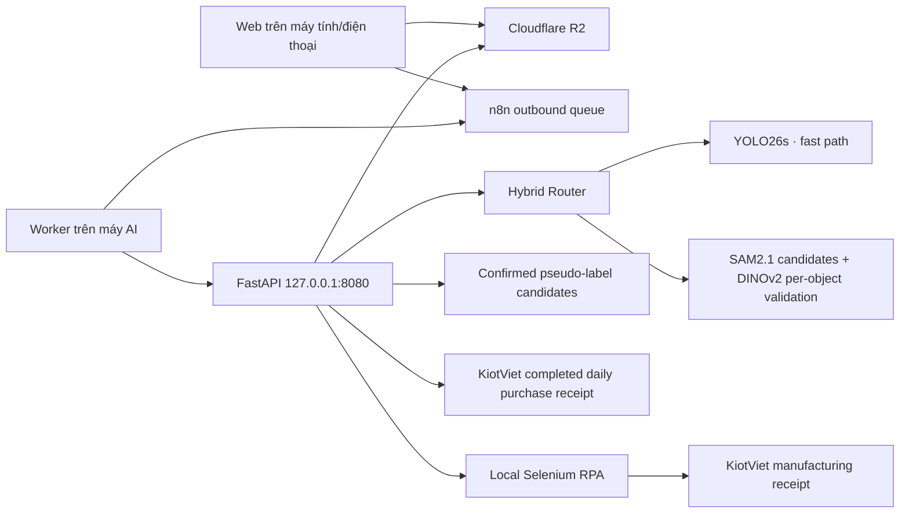

# Sharon Bakery AI Inventory

[](https://github.com/philonguit-blip/sharon-ai-inventory-inspection/actions/workflows/ci.yml)

Hệ thống hybrid kiểm đếm bánh từ một hoặc nhiều ảnh cùng SKU: YOLO26s xử lý nhanh các
SKU đã học; SAM2.1 + DINOv2 nhận diện bằng ảnh tham chiếu khi SKU/ảnh chưa chắc
chắn. Người vận hành luôn xác nhận trước khi ghi phiếu nhập KiotViet.

Hướng dẫn khởi động: [HUONG_DAN_CAI_DAT_VA_KHOI_DONG.md](HUONG_DAN_CAI_DAT_VA_KHOI_DONG.md).
Hướng dẫn Hybrid/SKU mới: [HYBRID_OPERATIONS_GUIDE.md](HYBRID_OPERATIONS_GUIDE.md).

## Kiến trúc hiện tại



- Ảnh được upload thẳng lên R2 bằng presigned URL.
- Máy AI chủ động poll n8n, không cần tunnel hoặc mở cổng inbound.
- Một job nhận tối đa 50 ảnh hoặc một thư mục ảnh của cùng một SKU; count được cộng theo ảnh.
- Mỗi ảnh phải là một khay/lô cần cộng riêng, không tải nhiều góc của cùng một khay.
- 27 visual classes YOLO ánh xạ thành 37 business SKU; catalog vận hành có thêm 13 SKU Foundation-only, tổng cộng 50 sản phẩm có thể xác nhận.
- Class `DIRECT` xác nhận trực tiếp; class `FAMILY` bắt buộc chọn SKU thành viên.
- Không ghi KiotViet trước bước xác nhận.
- Sau khi xác nhận, người dùng chọn **Phiếu nhập hàng** hoặc **Phiếu sản xuất**.
- Phiếu nhập hàng dùng Public API và gộp theo ngày; phiếu sản xuất dùng RPA local,
  tạo riêng cho từng job và mặc định lưu hoàn tất.
- `AUTO` giữ fast path khi YOLO đã vượt cổng an toàn và không có proposal thấp
  cần cứu; các proposal hợp lệ được xác minh bằng một lượt SAM2 box-prompt và
  DINOv2 batch trước khi hệ thống cân nhắc fallback toàn ảnh.
- `COMPARE` bất đồng SKU/count sẽ chuyển `REVIEW`, không tự tạo phiếu.
- Công cụ chuẩn bị Foundation reference hỗ trợ xuất nền gốc, nền trắng hoặc cả
  hai; mask nền trắng ưu tiên biên SAM đã đối chiếu, chỉ dùng GrabCut có chặn an
  toàn khi cần, giúp loại khay/bóng mà không cắt mất vỏ bánh.
- Web test Foundation có cùng lựa chọn nền, preview/tải PNG và chỉ cập nhật thư
  viện embedding sau khi người dùng bấm `Build & activate`.
- Web test Foundation nhận đồng thời ảnh/video, lọc và tách frame theo FPS–độ
  nét–pHash rồi pre-annotate toàn bộ dữ liệu giữ lại vào một ZIP YOLO/COCO.

## Cấu hình production

| Thành phần | Giá trị |
|---|---:|
| Model | `backend/models/best_YOLO26s_2429_27SKUs.pt` · YOLO26s, 27 visual classes |
| Số ảnh/job | 1–50, cùng một SKU |
| Dung lượng ảnh tối đa | 50 MB |
| Tổng dung lượng/job | 200 MB |
| YOLO inference image size | 1024 |
| IoU | 0.50 |
| Candidate confidence | Theo class: `min(threshold, max(0.05, threshold × 0.5))`; candidate chưa được tính nếu Foundation chưa xác minh |
| Minimum dominant purity | 0.90 |
| R2 transfer workers | 1 |
| YOLO inference batch | 4 ảnh/lượt, tự fallback từng ảnh nếu thiếu RAM |
| Foundation references | 713 embeddings / 40 reference classes |
| Foundation SAM input | max side 1280, point stride 96 |
| Foundation object gate | DINO similarity 0.60, margin 0.02, area 0.35×–2.50× median |
| Foundation device hiện tại | CPU; cần benchmark lại sau tối ưu trên bộ ground truth |

Threshold từng class và ánh xạ SKU nằm duy nhất tại
`backend/config/product_mapping.json`. Manifest/checksum model nằm tại
`backend/models/MODEL_MANIFEST.json`.

## Cấu trúc lưu trữ

| Đường dẫn | Vai trò |
|---|---|
| `backend/app` | API, inference, worker, R2, n8n và KiotViet |
| `backend/config` | Mapping 27 visual classes → 37 YOLO SKU và catalog 50 sản phẩm được hỗ trợ |
| `backend/hybrid_data` | DINOv2 reference artifact; ảnh reference private bị Git bỏ qua |
| `backend/frontend` | Một nguồn HTML/CSS/JS cho local, Pages và n8n embedded UI |
| `backend/models` | Chỉ model production và manifest |
| `backend/tests` | Unit/integration tests |
| `n8n` | Generator, workflow production và mô phỏng queue |
| `scripts` | Kiểm tra cấu trúc/artifact production |
| `docs` | Runbook và chính sách artifact |
| `data`, `pre-annotation`, `sharon-cv-pipeline` | Khu vực nghiên cứu local, không thuộc production Git |
| `_archive` | Backup/legacy local, bị Git bỏ qua |

## Chạy hằng ngày

1. Nếu trong ngày cần tạo phiếu sản xuất, mở Docker Desktop rồi chạy
   `start_manufacturing_rpa.bat` trước.
2. Chạy `start_backend.bat`.
3. Chờ `Application startup complete`.
4. Chạy `start_worker.bat`.
5. Giữ các cửa sổ đang dùng mở.
6. Mở <https://n8n.sharon-finefoods.com/webhook/sharon-bakery-inventory>.
7. Giữ chế độ `AUTO` cho vận hành hằng ngày.

Local UI: <http://127.0.0.1:8080>. Không truy cập `0.0.0.0:8080`.

## Cài mới và kiểm tra

```powershell
Set-ExecutionPolicy -Scope Process Bypass
.\setup_windows.ps1

.\backend\.venv\Scripts\python.exe .\scripts\verify_production.py
cd backend
.\.venv\Scripts\python.exe -m pytest tests -q
cd ..
node n8n\generate_workflow4_outbound.mjs
node n8n\test_workflow4_outbound.mjs
```

Kiểm tra Foundation: `backend\.venv\Scripts\python.exe scripts\hybrid_reference_manager.py status`.

Workflow generator nhúng trực tiếp `backend/frontend` vào node Web UI, giúp loại
bỏ tình trạng frontend trong n8n lệch phiên bản so với frontend local.

Khi các ảnh trong một batch cùng SKU bị model dự đoán thành nhiều class, hệ thống
chuyển sang `REVIEW`, giữ tổng count và yêu cầu người vận hành chọn lại sản phẩm
trong catalog. Trường hợp này không tự ghi KiotViet.

Dọn job runtime cũ (mặc định chỉ xem trước):

```powershell
.\scripts\cleanup_runtime.ps1 -OlderThanDays 14
.\scripts\cleanup_runtime.ps1 -OlderThanDays 14 -Apply
```

## An toàn KiotViet

Sau khi người vận hành xác nhận, backend tìm phiếu AI của chi nhánh trong ngày
hiện tại (múi giờ Việt Nam). Nếu chưa có, hệ thống tạo một phiếu hoàn thành; nếu
đã có, hệ thống ưu tiên cập nhật phiếu đó bằng `PUT /purchaseorders/{id}`. SKU
trùng được cộng số lượng, SKU mới được thêm thành dòng mới. Phiếu thủ công không
có marker AI không bị sửa.

Nếu KiotViet từ chối cập nhật dòng hàng của phiếu đã hoàn thành (thực tế API trả
`HTTP 420 KvValidatePurchaseOrderException`), backend tạo một phiếu hoàn thành
thay thế đã gộp đủ dữ liệu, xác
minh phiếu mới rồi hủy phiếu cũ. Marker `AIR:<receipt_id>` cho phép lần retry hoàn
tất bước hủy nếu kết nối bị ngắt giữa hai thao tác. Lỗi mạng không xác định không
kích hoạt thay thế để tránh tạo trùng.

Trước khi ghi KiotViet, backend lưu trạng thái `CONFIRMING`. Mỗi job được gắn
marker ngắn trong mô tả phiếu hằng ngày. Nếu máy bị ngắt sau khi KiotViet đã nhận
request, lần retry sẽ tìm marker và không cộng cùng một job lần thứ hai.

Các cấu hình mặc định cho luồng này là:

```env
KIOTVIET_CREATE_AS_DRAFT=false
KIOTVIET_MERGE_DAILY_DRAFTS=true
KIOTVIET_REPLACE_COMPLETED_ON_UPDATE_FAILURE=true
```

## Phiếu sản xuất

KiotViet manufacturing được thực hiện qua project sibling
`sharon-bakery-docker_manufacturing`. Cài một lần bằng
`sharon-bakery-docker_manufacturing\setup-rpa.ps1`; script yêu cầu tài khoản web,
tạo token ngẫu nhiên và đồng bộ token vào `backend/.env` mà không in mật khẩu.

RPA lưu trạng thái theo chính `job_id`. Request đã thành công được trả lại thay
vì tạo lần hai. Mặc định RPA bấm **Hoàn thành/Lưu**, không tạo phiếu tạm. Nếu
kết nối lỗi sau thời điểm bấm lưu, trạng thái chuyển
`UNCERTAIN` và hệ thống dừng retry tự động để người vận hành kiểm tra KiotViet.

## Bảo mật

- Không commit `backend/.env`, token, signed URL hoặc credential.
- Đồng bộ Basic Auth giữa `backend/.env` và credential n8n.
- Phiếu AI được hoàn thành ngay và gộp theo ngày; không tự sửa phiếu thủ công.
- Xem thêm [SECURITY.md](SECURITY.md) và [docs/ARTIFACTS.md](docs/ARTIFACTS.md).

## Bảng Developer ẩn

- Giữ logo **SB** khoảng 1,2 giây, bấm logo 7 lần trong 4 giây, hoặc nhấn
  `Ctrl+Shift+D` để mở.
- Nhập `DEVELOPER_SETTINGS_KEY`. Nếu biến này chưa được đặt, hệ thống dùng
  `APP_AUTH_PASSWORD` để tương thích với cấu hình hiện tại.
- Có thể chọn model `.pt`/`.onnx` nằm trong `backend/models` và chỉnh confidence
  riêng cho từng visual class.
- Model mới được nạp và kiểm tra class/mapping trước khi hot-swap. Nếu kiểm tra
  thất bại, model đang chạy không bị thay đổi.
- Cấu hình được lưu tại `backend/runtime/developer_settings.json`, tồn tại sau
  khi khởi động lại và chỉ áp dụng cho các job mới.
